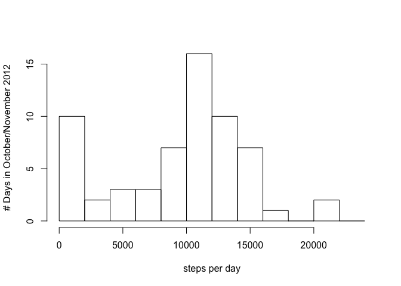
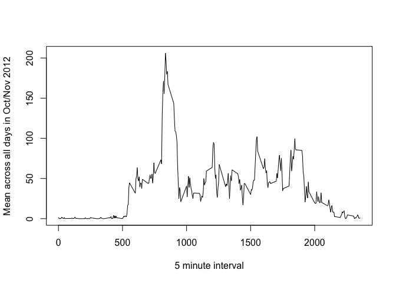
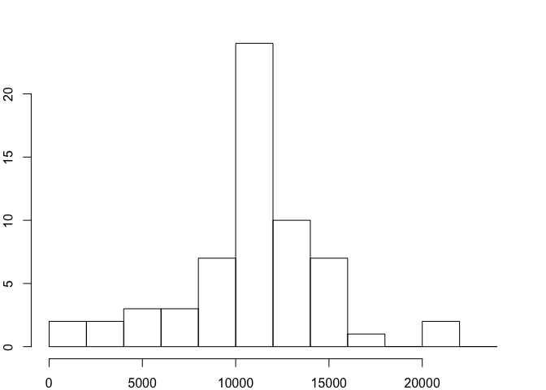
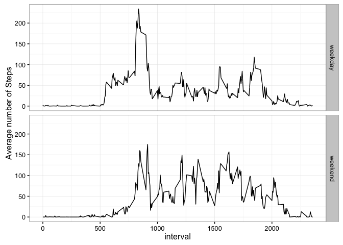

# Reproducible Data: Project 1
Gail Muldoon  
January 10, 2016  

### Loading and pre-processing the data


```r
setwd("/Users/gail/Documents/Courses/NONUT/DataSci/Reproducible/Week1/RepData_PeerAssessment1")
datfile <- "data/activity.csv"

activity <- read.csv(datfile)
activity$date <- as.Date(activity$date, "%Y-%m-%d")
activity$date <- format(activity$date, "%m/%d/%Y")
```
## What is mean total number of steps taken per day?

```r
library(ggplot2)
```

```
## Warning: package 'ggplot2' was built under R version 3.2.3
```

```r
library(Hmisc)
```

```
## Warning: package 'Hmisc' was built under R version 3.2.3
```

```
## Loading required package: lattice
```

```
## Loading required package: survival
```

```
## Loading required package: Formula
```

```
## 
## Attaching package: 'Hmisc'
```

```
## The following objects are masked from 'package:base':
## 
##     format.pval, round.POSIXt, trunc.POSIXt, units
```

```r
require(lubridate)
```

```
## Loading required package: lubridate
```

```
## Warning: package 'lubridate' was built under R version 3.2.3
```

```r
require(RColorBrewer)
```

```
## Loading required package: RColorBrewer
```

```r
require(dplyr)
```

```
## Loading required package: dplyr
```

```
## 
## Attaching package: 'dplyr'
```

```
## The following objects are masked from 'package:lubridate':
## 
##     intersect, setdiff, union
```

```
## The following objects are masked from 'package:Hmisc':
## 
##     combine, src, summarize
```

```
## The following objects are masked from 'package:stats':
## 
##     filter, lag
```

```
## The following objects are masked from 'package:base':
## 
##     intersect, setdiff, setequal, union
```

```r
require(ggthemes)
```

```
## Loading required package: ggthemes
```

```r
library(scales)
```
### 1. Calculate the total number of steps taken per day (ignore missing values)

```r
steps_per_day <- tapply(activity$steps, activity$date, sum, na.rm=TRUE)
```
### 2. Make a histogram of the total number of steps taken each day

```r
hist(steps_per_day, xlab = "steps per day", main="",ylab="# Days in October/November 2012",breaks=seq(from=0, to=25000, by=2000))
```

\

### 3. Calculate and report the mean and median of the total number of steps taken per day

```r
mean(steps_per_day)
```

```
## [1] 9354.23
```

```r
median(steps_per_day)
```

```
## [1] 10395
```
The mean number of steps taken per day during October/November 2012 was approximately 9354. During the same period, the median steps taken per day was 10395. 

The difference between the two is due to the left-skewed distribution of steps during this time period.

## What is the average daily activity pattern?

###1. Make a time series plot (i.e. 𝚝𝚢𝚙𝚎 = "𝚕") of the 5-minute interval (x-axis) and the average number of steps taken, averaged across all days (y-axis)

```r
mean_steps_per_interval <- tapply(activity$steps, activity$interval, mean, na.rm = TRUE)

plot(row.names(mean_steps_per_interval), mean_steps_per_interval, type = "l", xlab = "5 minute interval", 
     ylab = "Mean across all days in Oct/Nov 2012", main = "")
```

\

###2. Which 5-minute interval, on average across all the days in the dataset, contains the maximum number of steps?

```r
max_steps_interval <- which.max(mean_steps_per_interval)
names(max_steps_interval)
```

```
## [1] "835"
```
The interval with the maximum number of steps averaged over each day is 835.

## Inputing missing values


###Note that there are a number of days/intervals where there are missing values (coded as 𝙽𝙰). The presence of missing days may introduce bias into some calculations or summaries of the data.

### 1. Calculate and report the total number of missing values in the dataset (i.e. the total number of rows with 𝙽𝙰s)

```r
na_cnt <- sum(is.na(activity))
```

### 2. Devise a strategy for filling in all of the missing values in the dataset. The strategy does not need to be sophisticated. For example, you could use the mean/median for that day, or the mean for that 5-minute interval, etc.
NA values correspond to several days when there are no observations. It would probably be best to use an average for the days surrounding those missing observations, but to keep things simple I'll fill in the NAs with 5 minute interval means. 

### 3. Create a new dataset that is equal to the original dataset but with the missing data filled in.

```r
activity_no_NA <- activity
activity_no_NA$steps <- impute(activity$steps, fun=mean)
```

### 4. Make a histogram of the total number of steps taken each day and Calculate and report the mean and median total number of steps taken per day. Do these values differ from the estimates from the first part of the assignment? What is the impact of imputing missing data on the estimates of the total daily number of steps?

```r
steps_per_day_filled <- tapply(activity_no_NA$steps, activity_no_NA$date, sum)
par(mar = rep(2, 4))
hist(steps_per_day_filled, xlab='Steps per day with NAs filled', ylab='Frequency', main="",breaks=seq(from=0, to=25000, by=2000))
```

\

```r
mean(steps_per_day_filled)
```

```
## [1] 10766.19
```

```r
median(steps_per_day_filled)
```

```
## [1] 10766.19
```

```r
mean_steps_per_interval <- tapply(activity$steps, activity$interval, mean, na.rm = TRUE)
activity_no_NA$steps <- mean_steps_per_interval
```
When the NAs have been filled in, the mean and median steps per day is ~10766. This is higher than either the mean or median of total steps per day calculated before infilling the missing values. Because the mean and median are the same, it also indicates that the distribution is no longer skewed as it was before. 

## Are there differences in activity patterns between weekdays and weekends?
### 1. Create a new factor variable in the dataset with two levels – “weekday” and “weekend” indicating whether a given date is a weekday or weekend day.

```r
activity_no_NA$date <- as.Date(activity_no_NA$date, "%m/%d/%Y")
activity_no_NA$weekend <- "weekday"
activity_no_NA$weekend[weekdays(activity_no_NA$date) %in% c("Saturday","Sunday")] <- "weekend"
activity_no_NA$weekend <- as.factor(activity_no_NA$weekend)
activity_no_NA <- activity_no_NA %>% group_by(interval, weekend)
```
### 2. Make a panel plot containing a time series plot (i.e. 𝚝𝚢𝚙𝚎 = "𝚕") of the 5-minute interval (x-axis) and the average number of steps taken, averaged across all weekday days or weekend days (y-axis). See the README file in the GitHub repository to see an example of what this plot should look like using simulated data.

```r
activity_no_NA$steps[weekdays(activity_no_NA$date) %in% c("Saturday","Sunday")] <- tapply(activity$steps[weekdays(activity_no_NA$date) %in% c("Saturday","Sunday")], activity$interval[weekdays(activity_no_NA$date) %in% c("Saturday","Sunday")], mean, na.rm = TRUE)

activity_no_NA$steps[!(weekdays(activity_no_NA$date) %in% c("Saturday","Sunday"))] <- tapply(activity$steps[!(weekdays(activity_no_NA$date) %in% c("Saturday","Sunday"))], activity$interval[!(weekdays(activity_no_NA$date) %in% c("Saturday","Sunday"))], mean, na.rm = TRUE)
  
qplot(x = interval, y = steps, data = activity_no_NA, geom = c("line"), facets = weekend~., ylab = "Average number of Steps") + theme_bw()
```

\
 As the figure shows, weekends are associated with a higher number of steps on average at all times of the day other around the 835th interval, which is the time when weekday steps peak. Overall, variability in number of steps is also higher throughout the day on weekends. In general, weekday number of steps during the day is a more skewed distribution than the weekend distribution of number of steps.
